# JwtAuthDemo Repository

# .NET Authentication & Authorization Learning Project

A comprehensive learning project demonstrating modern authentication and authorization patterns in ASP.NET Core 9.0, featuring JWT-based stateless authentication, fine-grained permission systems, and task management APIs.

## 📚 Key Learning Concepts

1. **Custom Authorization Handler:** The `PermissionAuthorizationHandler` demonstrates how to implement custom authorization logic that queries the database to validate user permissions.
2. **Secure Password Management:** Uses `BCrypt` for password hashing with proper salt generation and verification.
3. **Clean API Design:** RESTful endpoints with proper HTTP status codes, validation, and error handling.

## System Architecture



## Core API Request Processing Pipeline

The system processes API requests through a well-defined middleware pipeline that enforces security policies before reaching business logic. Each request flows through JWT authentication, permission validation, and finally to the appropriate controller action.



## Security Architecture

The system implements a multi-layered security model combining JWT stateless authentication with a custom permission-based authorization system. Authentication is handled through standard JWT Bearer tokens, while authorization uses custom attributes and handlers to enforce fine-grained access control.

### Security Components

| Security Layer        | Component                            | Purpose                                             |
| --------------------- | ------------------------------------ | --------------------------------------------------- |
| Authentication        | `JWT Bearer`                         | Validates token signatures and claims               |
| Authorization Filter  | `PermissionBasedAuthorizationFilter` | Intercepts requests requiring permissions           |
| Permission Attribute  | `CheckPermissionAttribute`           | Declares required permissions on controller actions |
| Authorization Handler | `PermissionAuthorizationHandler`     | Evaluates user permissions against requirements     |
| Password Security     | `PasswordHelper`                     | BCrypt hashing for credential storage               |

The permission system supports four core operations defined in the `Permission` enum: `Create`, `Read`, `Update`, and `Delete`. Each controller action can be decorated with `[CheckPermission(Permission.X)]` attributes to enforce specific access requirements or use a list of permissions.

## Technology Stack and Dependencies


## Core Data Model

The system manages three primary entities with clear relationships and responsibilities:

| Entity           | Purpose                          | Key Properties                                                    |
| ---------------- | -------------------------------- | ----------------------------------------------------------------- |
| `User`           | User accounts and authentication | `Id`, `Username`, `Password`, `Email`                             |
| `TodoTask`       | Task management and tracking     | `Id`, `Title`, `Description`, `TaskStatus`, `UserId`, `DateRange` |
| `UserPermission` | Permission assignments           | `UserId`, `Permission`                                            |
| `TimeSlot`       | Date range tracking              | `StartDate`, `EndDate`                                            |

## Key System Capabilities

This project provides the following core functionality:

- **Stateless Authentication**: JWT token-based authentication with configurable expiration and signing keys
- **Permission-Based Authorization**: Fine-grained access control using custom attributes and database-backed permission checks
- **Task Management**: Full CRUD operations for todo tasks with user assignment and status tracking
- **User Management**: User registration, authentication, and profile management with secure password hashing
- **API Documentation**: Integrated Swagger/OpenAPI documentation with Scalar UI for development and testing

## 🎓 Learning Notes

This project serves as a practical example of:
- How JWT tokens flow through the authentication pipeline
- Implementing custom authorization requirements beyond simple roles
- Structuring a Web API with proper separation of concerns
- Using Entity Framework Code-First migrations
- Securing sensitive operations with proper validation

## 🚀 Getting Started

### Prerequisites
- .NET 9.0 SDK
- SQL Server (LocalDB or full instance)
- Visual Studio 2022 or VS Code

### Setup
1. Clone the repository
2. Update connection string in `appsettings.json`
3. Run Entity Framework migrations:
   ```bash
   dotnet ef database update
   ```
4. Start the application:
   ```bash
   dotnet run
   ```
